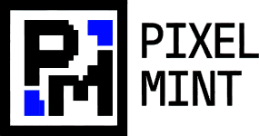

<p align="center">
  
</p>

<h1 align="center">Pixel Mint</h1>

<p align="center">
  <strong>A modern, feature-rich pixel art editor built with React and TypeScript</strong>
</p>

<p align="center">
  <a href="#features">Features</a> •
  <a href="#demo">Demo</a> •
  <a href="#installation">Installation</a> •
  <a href="#usage">Usage</a> •
  <a href="#keyboard-shortcuts">Shortcuts</a> •
  <a href="#themes">Themes</a> •
  <a href="#tech-stack">Tech Stack</a> •
  <a href="#license">License</a>
</p>

---

## ✨ Features

### 🎨 Drawing Tools
- **Pencil** - Draw individual pixels with adjustable size (1x1 to 5x5)
- **Eraser** - Remove pixels with variable brush size
- **Fill Bucket** - Flood fill or global fill options
- **Line Tool** - Draw straight lines between two points
- **Rectangle Tool** - Create rectangles and squares
- **Circle Tool** - Draw perfect circles
- **Eyedropper** - Pick colors directly from the canvas

### 🔤 Text Tool
- Interactive on-canvas text editing
- Multiple pixel-art fonts (Jersey 10, Pixelify Sans, VT323, Press Start 2P, and more)
- Resizable text with real-time preview
- Drag-to-position functionality

### 🎭 Brush Modes
- **Normal** - Standard drawing
- **Rainbow** - Color shifts as you draw
- **Random** - Random colors from palette
- **Dither** - Bayer matrix dithering patterns (2x2, 4x4, 8x8)

### 📐 Canvas Features
- Configurable canvas sizes: 16×16, 64×64, 128×128, 256×256
- Toggle grid overlay
- Ruler overlay for precise positioning
- Zoom controls
- Transparent background support

### 📦 Layer System
- Multiple layers support
- Layer visibility toggle
- Layer opacity control
- Layer reordering

### 🎨 Color Management
- Full color picker with hex input
- Quick palette slots
- Multiple built-in palettes

### ↩️ History
- Unlimited undo/redo
- Keyboard shortcuts support

### 💾 Export
- Export to PNG with transparency
- Preview before download

### 🎭 Themes
- **Coffee** - Warm brown tones
- **Based** - Classic retro style (default)
- **Candy** - Vibrant pink and purple
- **Dark** - Easy on the eyes

---

## 🚀 Demo

Visit the live demo: [Coming Soon]

---

## 📦 Installation

### Prerequisites
- Node.js ≥ 20
- npm ≥ 10

### Setup

```bash
# Clone the repository
git clone https://github.com/adnan911/Pixel-Mint.git

# Navigate to project directory
cd Pixel-Mint

# Install dependencies
npm install

# Start development server
npm run dev
```

The app will be available at `http://localhost:5173`

### Production Build

```bash
npm run build
```

---

## 🎮 Usage

1. **Choose Canvas Size** - Select your canvas dimensions on the welcome page
2. **Select Tools** - Use the toolbar on the left to switch between drawing tools
3. **Pick Colors** - Use the color picker or quick palette at the bottom
4. **Draw** - Click and drag on the canvas to create your artwork
5. **Export** - Click "Export Art" to save your creation as PNG

---

## ⌨️ Keyboard Shortcuts

| Action | Shortcut |
|--------|----------|
| Pencil | `P` |
| Eraser | `E` |
| Fill | `F` |
| Eyedropper | `I` |
| Line | `L` |
| Rectangle | `R` |
| Circle | `C` |
| Text | `T` |
| Undo | `Ctrl + Z` |
| Redo | `Ctrl + Y` |

---

## 🎨 Themes

Pixel Mint comes with 4 beautiful themes:

| Theme | Description |
|-------|-------------|
| **Based** | Classic retro pixel art style (Default) |
| **Coffee** | Warm, cozy brown tones |
| **Candy** | Vibrant pink and purple palette |
| **Dark** | Dark mode for low-light environments |

Toggle themes using the theme button on the welcome page.

---

## 🛠 Tech Stack

- **Framework**: [React 18](https://react.dev/)
- **Language**: [TypeScript](https://www.typescriptlang.org/)
- **Build Tool**: [Vite](https://vitejs.dev/)
- **Styling**: [Tailwind CSS](https://tailwindcss.com/)
- **UI Components**: [Radix UI](https://www.radix-ui.com/) + [shadcn/ui](https://ui.shadcn.com/)
- **Icons**: [Lucide React](https://lucide.dev/)
- **Fonts**: [Google Fonts](https://fonts.google.com/) (Pixel Art Collection)

---

## 📁 Project Structure

```
pixel-mint/
├── public/
│   ├── images/
│   │   └── logo/          # App logos and icons
│   └── favicon.png
├── src/
│   ├── components/
│   │   ├── pixel-art/     # Core editor components
│   │   │   ├── PixelCanvas.tsx
│   │   │   ├── DrawingToolbar.tsx
│   │   │   ├── ColorPicker.tsx
│   │   │   └── ...
│   │   └── ui/            # Reusable UI components
│   ├── hooks/             # Custom React hooks
│   ├── pages/
│   │   ├── WelcomePage.tsx
│   │   └── PixelArtEditor.tsx
│   ├── types/             # TypeScript type definitions
│   ├── utils/             # Utility functions
│   └── index.css          # Global styles & themes
├── package.json
└── vite.config.ts
```

---

## 🤝 Contributing

Contributions are welcome! Please feel free to submit a Pull Request.

1. Fork the repository
2. Create your feature branch (`git checkout -b feature/AmazingFeature`)
3. Commit your changes (`git commit -m 'Add some AmazingFeature'`)
4. Push to the branch (`git push origin feature/AmazingFeature`)
5. Open a Pull Request

---

## 📄 License

This project is licensed under the MIT License - see the [LICENSE](LICENSE) file for details.

---

## 👨‍💻 Author

**Adnan**

- GitHub: [@adnan911](https://github.com/adnan911)

---

<p align="center">
  Made with ❤️ and pixels
</p>
